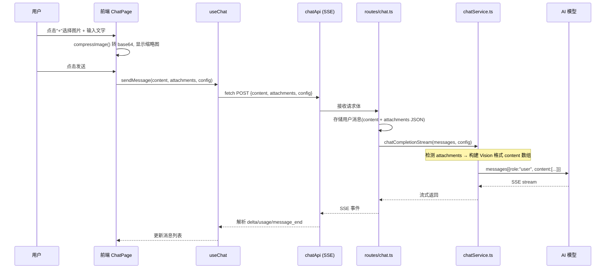

## 用户需求

在 AI 对话页面的输入框旁新增一个"+"按钮，点击后可以发送图片文件。AI 需要能识别图片内容并基于图片进行对话。

## 核心功能

- 输入框旁新增"+"按钮，点击弹出文件选择器（限制图片类型）
- 支持选择多张图片，发送前显示缩略图预览，可移除
- 图片经压缩后以 base64 内联方式发送给 AI 模型
- AI 回复中可识别图片内容并给出相关回答
- 用户消息气泡中展示图片缩略图
- 对话模型下拉框扩展为同时包含 vision 类别模型，方便选择视觉模型

## 第一阶段范围（本期）

仅支持图片发送（JPG/PNG），Word、PDF、飞书链接、腾讯文档链接等留后续扩展。

## 支持的视觉模型

| 提供商 | 模型 | 说明 |
| --- | --- | --- |
| OpenAI | gpt-4o, gpt-4o-mini, gpt-4.1 | 原生支持 Vision API |
| Google Gemini | gemini-2.5-flash, gemini-2.5-pro, gemini-2.0-flash | 通过 OpenAI 兼容端点 |
| DeepSeek | janus-pro | 原生多模态 |
| 阿里云 通义千问 | qwen-vl-max, qwen-vl-plus | 通过 OpenAI 兼容端点 |
| 字节跳动 豆包 | doubao-vision | 通过 OpenAI 兼容端点 |
| 百度 文心一言 | ernie-4-vision | 通过 OpenAI 兼容端点 |
| 讯飞 星火 | spark4-vision | 通过 OpenAI 兼容端点 |


## 技术方案

### 整体策略

复用项目已有的 `compressImage()` 工具函数将图片转为 base64，通过扩展 `SendMessageRequest` 增加 `attachments` 字段传递给后端。后端在构建 ChatMessage 时，检测是否存在附件，若存在则将 `content` 由纯文本字符串改为 OpenAI Vision API 的数组格式 `[{type: "image_url", ...}, {type: "text", ...}]`。由于各提供商均使用 OpenAI 兼容端点，该格式可统一使用。

### 数据流



### 关键设计决策

**1. 图片传输方式：base64 内联**

- 理由：项目已有 `compressImage()` 和 `imageToBase64()` 工具函数，且 ImageUploadZone 组件已验证此模式可行
- 图片先压缩至 1024px，质量 0.85，控制大小
- 无需额外文件存储服务器，降低复杂度

**2. 多模态消息格式：OpenAI Vision API 兼容格式**

```typescript
// 无附件（保持向后兼容）
{ role: 'user', content: '这张图片里有什么？' }

// 有附件（多模态格式）
{ role: 'user', content: [
  { type: 'image_url', image_url: { url: 'data:image/jpeg;base64,...' } },
  { type: 'text', text: '这张图片里有什么？' }
]}
```

- 所有提供商通过 OpenAI 兼容端点均支持此格式
- 一条消息可携带多张图片

**3. 数据库存储策略**

- 用户消息的 `content` 字段保持存储用户输入的纯文本
- 新增 `attachments` TEXT 列（JSON 格式），存储附件元信息数组
- 加载历史消息时，重新组装 base64 以渲染缩略图（或使用缩略图缓存）

**4. 模型选择扩展**

- 将 ChatPage 中 `ModelDropdown` 的 `category` 从 `['text']` 改为 `['text', 'vision']`
- 用户可以在纯文本模型和视觉模型之间切换
- 纯文本模型收到附件时自动忽略（降级为纯文本），由后端日志提示

### 性能要点

- 图片压缩至 1024px 以内，单张 base64 约 50-200KB，多张控制在 1MB 以内
- 历史消息加载时不重复压缩，直接使用已存的 base64 数据
- SSE 流式响应不受影响，附件仅在首次 POST 请求中传输

### 目录结构

```
lightbulb-AI/
├── frontend/src/
│   ├── types/
│   │   ├── index.ts              # [MODIFY] ChatMessage 增加 attachments 字段；新增 MessageAttachment 接口
│   │   └── api.ts                # [MODIFY] SendMessageRequest 增加 attachments 字段
│   ├── pages/
│   │   └── ChatPage.tsx          # [MODIFY] 输入区加"+"按钮、图片预览、附件状态管理；modelCategory 扩展；MessageBubble 用户消息显示图片缩略图
│   ├── hooks/
│   │   └── useChat.ts            # [MODIFY] sendMessage 签名增加 attachments 参数，构建用户消息时携带附件
│   └── services/
│       └── api.ts                # [MODIFY] chatApi.sendMessage body 增加 attachments
├── backend/src/
│   ├── middleware/
│   │   └── validateRequest.ts    # [MODIFY] sendMessageSchema 增加 attachments 可选数组校验
│   ├── services/
│   │   └── chatService.ts        # [MODIFY] ChatMessage.content 扩展为 string | MultimodalContent[]；chatCompletion/chatCompletionStream 支持多模态格式
│   ├── routes/
│   │   └── chat.ts               # [MODIFY] 接收 attachments，构建多模态消息，存储附件元信息
│   └── database.ts               # [MODIFY] chat_messages 表增加 attachments TEXT 列（可为 NULL）
```

### 修改文件详细说明

#### `frontend/src/types/index.ts` [MODIFY]

- 新增 `MessageAttachment` 接口：`{ type: 'image'; dataBase64: string; mimeType: string; fileName: string; width?: number; height?: number }`
- 修改 `ChatMessage` 接口：增加可选 `attachments?: MessageAttachment[]`
- 保持 `content: string` 不变

#### `frontend/src/types/api.ts` [MODIFY]

- 修改 `SendMessageRequest`：增加可选 `attachments?: { type: string; dataBase64: string; mimeType: string; fileName: string }[]`

#### `frontend/src/services/api.ts` [MODIFY]

- `chatApi.sendMessage` 方法签名增加 `attachments?: SendMessageRequest['attachments']` 参数
- body 中动态加入 `attachments` 字段

#### `frontend/src/hooks/useChat.ts` [MODIFY]

- `sendMessage` 签名扩展为 `(content: string, attachments?: MessageAttachment[], overrideConfig?: APIConfig)`
- 构建 `userMessage` 时传入 `attachments`
- 调用 `chatApi.sendMessage` 时传递 `attachments`

#### `frontend/src/pages/ChatPage.tsx` [MODIFY]

- 新增状态 `attachments: MessageAttachment[]`
- 输入区布局改造：输入框上方显示已选图片缩略图（可删除）；输入框左侧新增"+"按钮
- "+"按钮点击时触发隐藏的 `<input type="file" accept="image/*" multiple />`
- 图片选择后调用 `compressImage()` 压缩，生成缩略图预览
- `handleSendMessage` 将 `attachments` 传入 `sendMessage`，发送后清空附件
- `ModelDropdown` 的 `category` 从 `['text']` 改为 `['text', 'vision']`
- `MessageBubble` 用户消息渲染：当 `message.attachments` 存在时，在文本上方展示图片缩略图网格

#### `backend/src/middleware/validateRequest.ts` [MODIFY]

- `sendMessageSchema` 增加 `attachments: z.array(z.object({ type: z.string(), dataBase64: z.string(), mimeType: z.string(), fileName: z.string() })).optional()`

#### `backend/src/services/chatService.ts` [MODIFY]

- `ChatMessage.content` 类型从 `string` 改为 `string | MultimodalContent[]`
- 新增 `MultimodalContent` 类型
- `chatCompletion` 和 `chatCompletionStream` 中，检测 content 类型：若为数组则原样传递（Vision 格式），若为字符串则保持原有行为
- 日志中输出附件数量信息

#### `backend/src/routes/chat.ts` [MODIFY]

- 接收 `data.attachments`
- 存储用户消息时：`content` 存文本，`attachments` 列存 JSON 序列化的附件元信息
- 构建给 chatService 的消息时，如有附件则将用户消息的 content 转为 Vision 数组格式
- 加载历史消息时，解析 `attachments` 列，重新组装 ChatMessage

#### `backend/src/database.ts` [MODIFY]

- `chat_messages` 表新增 `attachments TEXT` 列（可为 NULL，DEFAULT NULL）
- `createMessage` 函数增加可选 `attachments?: string` 参数
- `getMessagesByConversationId` 查询结果包含 `attachments` 字段
- 数据库迁移：ALTER TABLE 增加列（如已存在则跳过）

## 设计风格

保持与现有 AI 对话页面的设计语言一致，采用简约现代风格。在输入区域增加轻量的"+"按钮，并以内联方式展示图片缩略图，不破坏现有布局。

## 输入区域改造

**布局结构调整**：在 Textarea 左侧新增圆形"+"按钮（36x36px），使用 `Plus` 图标，采用 `outline` 样式。当有已选图片时，输入框上方出现一条水平缩略图预览条。

**图片预览条**：水平排列，每张缩略图 64x64px 圆角方形，右上角有圆形删除按钮（`X` 图标），hover 时显示红色背景。可横向滚动（`overflow-x-auto`），最多显示 5-6 张。

**文件选择交互**：点击"+"按钮触发隐藏的 `<input type="file" accept="image/*" multiple />`，选择图片后即时压缩并显示预览。支持拖拽图片到输入区域（复用 ImageUploadZone 的拖拽逻辑）。

## MessageBubble 用户消息增强

**图片展示**：当用户消息携带有 `attachments` 时，在文本内容上方展示图片网格。最多 3 列，图片带圆角边框，点击可放大查看（使用现有 dialog 组件）。图片尺寸适屏（max-width: 200px）。

**暗色模式**：所有新增元素均适配 `dark:` 变体。