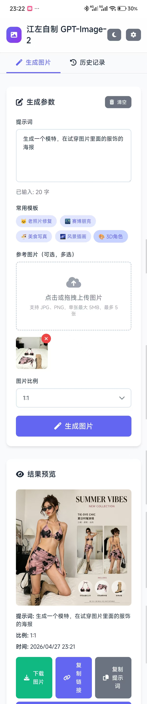

# image2-tools

#### 介绍
不需要魔法，谷歌账号，和国外银行卡。下载index.html，用浏览器打开，最开始使用需要配置API-kEY 。
本质上本工具就是代理，所以模型收费和我没关系，我只是个个人开发者。

#### 软件架构
软件架构说明

#### 安装教程

下载index.html.然后用浏览器打开
输入api-key就可以使用了.

#### 使用说明

稍微有偿一点可以吗。
十块，我会一步步指导你。我弄了两天[看]。会给你免费试用的额度,包能用的

不需要魔法，谷歌账号，和国外银行卡。
积分可以自己找代理冲,可能需要自己改一下代码参数，
也可以找我，大概五十元五百张左右。
工具本质就是个gpt-image2代理，所以模型收费和我没关系，我只是个个人开发者。
给的是我个人开发的源码，能直接运行在各个浏览器上，稳定代理，自己可以二次创作或者直接使用。
数据都在自己设备里，不会泄露。自己会二改可以调用其他厂商，其他模型
#### 效果展示

